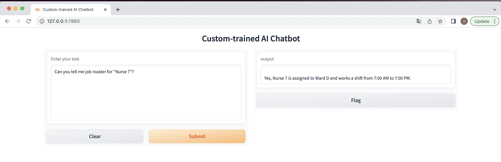
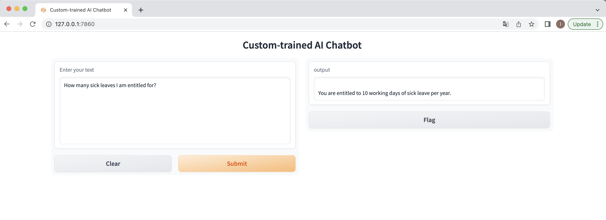
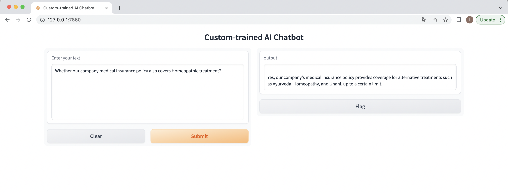

# HR Assistant Tool:

An AI-based HR assistant chatbot powered by ChatGPT can revolutionize the way HR departments operate. It can assist employees and managers with HR-related queries and streamline the process of managing job rosters.

The chatbot can be trained on various HR policies, procedures, and guidelines such as employee onboarding, payroll, benefits, leave policies, performance reviews, and more. It can also be trained on job roster management, including scheduling and assigning tasks to employees.

## HR Assistant Screenshots

## Follow below instruction to use this HR assistant tool:
1. Take clone of this repository.
2. Install Python3 (Pip3) on your computer. Follow below URL to setup python.
*       https://realpython.com/installing-python/
3. To check if Python is properly installed, open the Terminal on your computer and check version.
*       python3 --version
4. Install PIP
*       python3 -m pip install -U pip
5. To check if Pip was properly installed, run the below command. 
*        pip3 --version
6. Set Up the Software Environment to Train an AI Chatbot i.e. install OpenAI, GPT Index, PyPDF2, and Gradio Libraries
7. Open the Terminal and run the below command to install the OpenAI library. 
*        pip3 install openai
8. Install GPT Index, which is also called LlamaIndex. It allows the LLM to connect to the external data that is our knowledge base. 
*        pip3 install gpt_index==0.4.24
9. nstall PyPDF2 to parse PDF files. If you want to feed your data in PDF format, this library will help the program read the data effortlessly. Apart from that, install PyCryptodome by running the below command. This is again done to avoid any errors while parsing PDF files.
*        pip3 install PyPDF2
*        pip3 install PyCryptodome
10. Install the Gradio library. This is meant for creating a simple UI to interact with the trained AI chatbot. 
*        pip3 install gradio
11. Download a Code Editor like Visual studio code

12. To train and create an AI chatbot based on a custom knowledge base, we need to get an API key from OpenAI. The API key will allow you to use      OpenAI’s model as the LLM to study your custom data and draw inferences. 
*        Head to platform.openai.com/signup and create a free account. If you already have an OpenAI account, simply log in.
*        Next, click on your profile in the top-right corner and select “View API keys” from the drop-down menu.
*        Here, click on “Create new secret key” and copy the API key. Do note that you can’t copy or view the entire API key later on. So it’s strongly recommended to copy and paste the API key to a Notepad file immediately.
13. Export API key as environment variable.
*        export OPENAI_API_KEY='<API key>'
14. create a new folder called docs in an accessible location like the Desktop. You can choose another location as well according to your preference. However, keep the folder name docs.
15. Next, move the documents you wish to use for training the AI inside the “docs” folder. You can add multiple text or PDF files (even scanned ones). If you have a large table in Excel, you can import it as a CSV or PDF file and then add it to the “docs” folder. 
16. Now, open the Terminal and run the below command to move to the Desktop. It’s where I saved the “docs” folder and “app.py” file. If you saved both items in another location, move to that location via the Terminal.
*        cd Desktop
17. Now, run the below command. Linux and macOS users may have to use python3.
*        python3 app.py
18. Once the LLM has processed the data, you will find a local URL. Copy it.
19. Now, paste the copied URL into the web browser, and there you have it. Your custom-trained ChatGPT-powered AI chatbot is ready. To start, you can ask the AI chatbot what the document is about.
